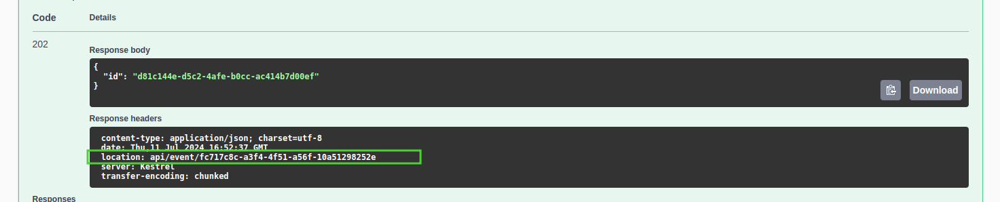

# Rent Vehicles

Este projeto tem o intuito de servir como meio de cadastros de `Veículos`, `Usuários` e `Aluguel de Veículos` por esses usuários.


Acima, podemos ver a arquitetura que foi desenhada e implementada no código deste repositório.

Optei por usar o RabbitMQ como broker, com a ideia de trabalhar de forma assíncrona e distribuída. Adotei a estratégia de separar a escrita da leitura, a fim de que a escrita e a leitura não sejam concorrentes entre si. O banco escolhido para a escrita foi o PostgreSQL, e o banco de leitura escolhido foi o MongoDB.

Abaixo, explicarei um pouco mais sobre cada projeto, mas primeiro gostaria de explicar como se dá o fluxo de input de dados no sistema.

Por exemplo, ao receber o comando `CreateVehiclesCommand`, responsável por criar um Veículo, seu receptor salva os dados enviados neste comando na tabela `Commands` e dispara o evento `CreateVehiclesEvent`, que, por sua vez, é responsável por salvar os dados dos veículos na tabela `Veículos`. O receptor do evento `CreateVehiclesEvent` valida se o conjunto de dados recebidos está respeitando as regras de negócio do domínio Veículo antes de persistir a informação na tabela `Veículos`.

Caso esteja respeitando todas as regras de negócio do domínio Veículo, esse registro será salvo e um novo evento `CreateVehiclesProjectionEvent` será disparado. O receptor deste evento `CreateVehiclesProjectionEvent` é responsável por obter os dados referentes ao Veículo salvo anteriormente no banco de escrita e copiar esses dados do banco de escrita para o banco de leitura.

## Rent.Vehicles.Api

Esta aplicação é a nossa porta de entrada, é através dela que inputamos os dados dos domínios acima citados. Este projeto não possui uma grande quantidade de regras de negócio, pois ele serve apenas como uma ponte entre o usuário e os domínios de Veículo, Usuário e Aluguel de Veículos. Como dito acima, por ter optado por trabalhar de maneira assíncrona e distribuída, este projeto recebe comandos através dos verbos POST, PUT e DELETE e os envia para o broker, acessando os dados salvos em nosso banco de leitura através do verbo GET.

## Rent.Vehicles.Consumer - Commands

Esta aplicação é responsável por receber os comandos e salvá-los em nosso banco de escrita, além de disparar o evento de consolidação deste domínio em sua respectiva tabela no banco de escrita.

## Rent.Vehicles.Consumer - Events

Esta aplicação é responsável por receber os eventos de consolidação dos domínios e salvá-los em nosso banco de escrita, caso estejam respeitando as regras de negócio. Se o evento respeitar todas as regras, seu receptor dispara o evento de consolidação deste domínio em sua respectiva tabela no banco de leitura. Caso contrário, o processo é interrompido.

## Rent.Vehicles.Consumer - Events/Events Projection

Esta aplicação é responsável por consolidar os dados dos eventos em nosso banco de escrita e por consolidar esses mesmos dados dos eventos salvos em nosso banco de escrita em nosso banco de leitura.

Este projeto é de suma importância, pois vai fornecer insumos para que o endpoint `api/event/{sagaId}` funcione.

> **NOTA:**
>
> As aplicações `Rent.Vehicles.Consumer - Commands`, `Rent.Vehicles.Consumer - Events` e `Rent.Vehicles.Consumer - Events/Events Projection` são deploys do mesmo projeto `Rent.Vehicles.Consumer`. O que as diferencia é um conjunto de parâmetros que são passados em sua inicialização. Segue abaixo uma imagem do conjunto de dados que pode ser passado para o projeto `Rent.Vehicles.Consumer`.
>
> 

## Considerações sobre  utilização da Api

Para efetuar o aluguel de algum `Veiculo` é necessário passar o id do plano de aluguel, para isso liste os planos através do endpoint `api/rent/rentalplanes`

Todos os endpoints que utilizam os verbos `POST`,`PUT`,`DELETE`, retornam o status code 202 acompanhado por um response headers como o abaixo



Para saber o status dos eventos, basta fazer um requisição get para o endpoint retornado no header location

## Considerações Técnicas

### Inicializar Aplicação

```sh
docker compose -f docker-compose.yaml -f docker-compose-infra.yaml up -d
```

### Rodar Testes Integrados

Certifique-se de que as dependências estejam de pé:

```sh
docker compose -f docker-compose-infra.yaml up -d
```

Após rodar o commando acima, rode o comando:

```sh
dotnet test
```

### Veículos do ano 2024

Os veículos do ano 2024 também estão sendo salvos na tabela `vehiclesforspecificyearprojections` no banco NoSql

### ISerializer

A fim de reduzir a replicação de código e manter o comportamento das aplicações coeso entre si, optei por utilizar a interface `ISerializer`. Desta forma, nos momentos em que preciso serializar ou desserializar o dado, não preciso da implementação concreta do método que faz tais ações. Dessa maneira, deixo meu código flexível e aberto a mudanças de comportamento sem ter que alterar os códigos que dependem desta interface.

### IConsumer

O mesmo se aplica para a interface `IConsumer`. Consigo, através dela, alterar o comportamento e até mesmo o broker que estamos utilizando sem ter que alterar o código fonte.

> **NOTA:**
>
> É importante lembrar que o código concreto que a interface `IConsumer` venha a abstrair necessita bloquear a thread em que está contido, pois a abordagem adotada de `Event Loop Consumer` preconiza essa afirmação. Abaixo podemos ver um exemplo:
> 
>
> Neste caso, a thread ficará aguardando o recebimento de alguma mensagem, sem causar qualquer prejuízo de performance ou provocar algum loop infinito.
>
> Bibliotecas que dão suporte a esta abordagem.
>
> [AMQPNetLite.Core](https://www.nuget.org/packages/AMQPNetLite.Core)
>
> [Confluent.Kafka](https://www.nuget.org/packages/Confluent.Kafka)