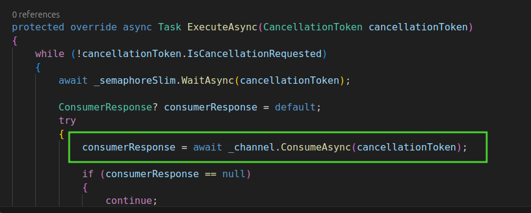

# Rent Vehicles

Este projeto tem o intuito de servir como meio de cadastros de `Veículos`, `Usuários` e `Aluguel de Veículos` por esses usuários.

Acima podemos ver a arquitetura que foi desenhada e implementada no código que segue neste repositório.

Optei por usar o RabbitMq como broker, com a ideia de trabalhar de forma assíncrona e distribuída. Adotei a estrategia de separar a escrita da leitura, afim de que a escrita e a leitura não sejam concrentes entre si, o branco que escolhi para ser o banco de escrita foi o Postgres, e o bando de leitura escolhido foi MongoDb.

Abaixo falarei um pouco mais sobre o que é cada projeto, mas primeiro gostaria de explicar como se da o fluxo do input de dados no sistema.

Exemplo, ao receber o commando CreateVehiclesCommand responsável por criar um Veículo, seu receptor, salva os dados enviados neste comando na tabela Commands e dispara o evento CreateVehiclesEvent, este por sua vez é responsável por salvar os dados de veículos na tabela da Veículos. O receptor do evento CreateVehiclesEvent, valida se o conjunto de dados recebidos esta respeitando as regras de neogeico do domino Veiculo antes de persistir a informação na tabela Veículos.

Caso esteja respeitando todas a regras de negocio do domínio Veiculo, esse registro será salvo e um novo evento CreateVehiclesProjectionEvent será disparado. O receptor deste evento CreateVehiclesProjectionEvent é responsável por obter os dados refentes ao Veiculo salvo anteriormente no banco de escrita e copiar esses dados do banco de escrita para o banco de leitura.

## Rent.Vehicles.Api

Esta aplicação é a nossa porta de entrada, é através dele que imputamos os dados dos domínios acima citados. Este projeto não possui um grande quantidade de regras de negocio, pois ele serve apenas como uma ponte ente o usuário e os domínios de Veiculo, Usuário e Aluguel de Veículos. Como dito acima por ter optado por trabalhar de maneira assíncrona e distribuída, este projeto recebe comandos através dos verbos POST, PUT e DELETE e os envia para broker e acessa os dados salvos em nosso banco de leitura através do vergo GET.

## Rent.Vehicles.Consumer - Commands

Esta aplicação é responsável por receber os commandos e os salvar em nosso banco de escrita e por disparar o evento de consolidação deste domínio em sua respectiva tabela em nosso banco de escrita.

## Rent.Vehicles.Consumer - Events

Esta aplicação é responsável por receber os eventos de consolidação dos dominos e os salvar em nosso banco de escrita, caso estejam respeitando as regras de negocio, se o evento esteja respeitando todas a regras, seu receptor dispara evento de consolidação deste domínio em sua respectiva tabela em nosso banco de leitura. Caso contrario o processo é interrompido

## Rent.Vehicles.Consumer - Events/Events Projection

Esta aplicação é responsável, por consolidar os dados do eventos em nosso banco de escrita e por consolidar esses mesmos dados do Eventos salvos em nosso banco de escrita em nosso banco de leitura.

Esse projeto é de suam importância por vai dar insumos para que o endpoint "api/event/{sagaId}", funcione.

> **NOTA:**
>
> As aplicações `Rent.Vehicles.Consumer - Commands`, `Rent.Vehicles.Consumer - Events`, `Rent.Vehicles.Consumer - Events/Events Projection` são deploys do mesmo projeto `Rent.Vehicles.Consumer`, o que as difênica são um conjunto de parâmeros que são passados em sua inicialização. Segue abaixo imagem do conjunto de dados que pode ser passado para o projeto `Rent.Vehicles.Consumer`.
>
> 

### Considerações técnicas

#### ISerializer

Afim de reduzir a replicação de código e manter o comportamento das aplicações coesas entre si, optei por utilizar a interface `ISerializer` desta forma nos momentos em que preciso serializar o deserializer o dado não preciso da implementação concreta do método que faz tais ações, desta maneira deixo meu código flexível e aberto a mudanças de comportamento sem ter que alterar os código que dependem desta interface.

#### IConsumer

O mesmo dito acima, se aplica para interface `IConsumer`, consigo através dele alterar o o comportamento e até mesmo broker que estejamos utilizando sem ter que alterar o código fonte.

> **NOTA:**
>
> Importante lembrar que o código concreto que interface `IConsumer`, venha a abstrair, necessita bloquear a thread em que esta contido, pois a abordagem adotada de `Event Loop Consumer`, preconiza esta afirmação. Abaixo podemos ver o exemplo.
> 
>
> Neste caso a thread ficará aguardando o recebimento de alguma mensagem, sem causar qualquer prejuízo de performance ou provocar algum loop infinito.
>
> Bibliotecas que dão suporte a esta abordagem. 
>
> [AMQPNetLite.Core](https://www.nuget.org/packages/AMQPNetLite.Core)
>
> [Confluent.Kafka](https://www.nuget.org/packages/Confluent.Kafka)